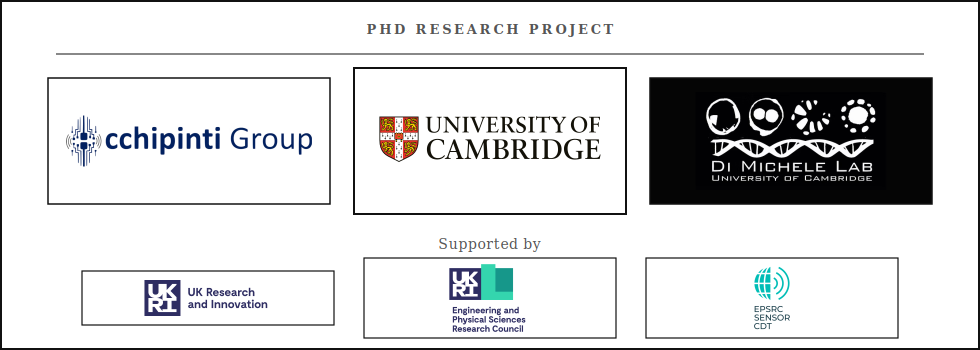

<p align="center">
  <picture>
    <source media="(prefers-color-scheme: dark)" srcset="docs/assets/droplets-mark-dark.svg">
    <source media="(prefers-color-scheme: light)" srcset="docs/assets/droplets-mark-light.svg">
    
  </picture>
</p>

<h1 align="center">DropLogic</h1>

<p align="center">
  <strong>Minimal, deployment-ready control for digital microfluidics.</strong>
</p>

<p align="center">
  <a href="https://franxi2953.github.io/DropLogic/"></a>
  
  <a href="LICENSE"></a>
  
  
</p>

<p align="center">
  <a href="https://franxi2953.github.io/DropLogic/">Documentation</a>
  ·
  <a href="https://franxi2953.github.io/DropLogic/getting_started/">Getting Started</a>
  ·
  <a href="https://franxi2953.github.io/DropLogic/systems/">Systems</a>
  ·
  <a href="https://franxi2953.github.io/DropLogic/planning/">Planning</a>
  ·
  <a href="https://franxi2953.github.io/DropLogic/visualization/">Visualization</a>
</p>

<p align="center">
  <picture>
    <source media="(prefers-color-scheme: dark)" srcset="docs/assets/readme-affiliations-dark.svg">
    <source media="(prefers-color-scheme: light)" srcset="docs/assets/readme-affiliations-light.svg">
    
  </picture>
</p>

DropLogic is a Python library for digital microfluidics (DMF): systems, modules, SIPP-based droplet planning, synchronized execution, visualization, and hardware-facing utilities in one library.

The project began as **Fran Quero's PhD project at the [University of Cambridge](https://www.cam.ac.uk/)**, developed across the **[Occhipinti Group](https://www.occhipintigroup.com/)** and the **[Di Michele Lab](https://www.dimichelelab.org/)** with support from **[UKRI](https://www.ukri.org/)**, **[EPSRC](https://www.ukri.org/councils/epsrc/)**, and the **[Sensor CDT](https://cdt.sensors.cam.ac.uk/)**. It is designed to make DMF control scripts readable while keeping the hardware-specific details isolated inside systems and modules.

> DMLite and BOXMini are hardware platforms from [Acxel](https://www.acxel.com/). This repository contains Python integration layers for supported hardware; it does not include vendor hardware or SDK/DLL assets.

## Quick Start

```bash
git clone https://github.com/franxi2953/DropLogic.git
cd DropLogic
pip install .
```

## What DropLogic Provides

- **Systems**: high-level machines such as `Simulator` and `DMLite`.
- **Modules**: reusable hardware components and version-specific implementations.
- **AdvancedDrop**: public planning API for droplets, movement, splitting, merging, mixing, and correction.
- **PlanExecutor**: synchronized frame execution, breakpoints, pause/resume, protocol saving, and video recording.
- **Visualizers**: matrix and live-stream views for execution, snapshots, and diagnostics.
- **Utilities**: calibration, coordinate conversion, drop vision, runtime checks, and plan debugging.

## Documentation

Full documentation is available at:

**[franxi2953.github.io/DropLogic](https://franxi2953.github.io/DropLogic/)**

Start with the [Getting Started Guide](https://franxi2953.github.io/DropLogic/getting_started/), then move to [Systems](https://franxi2953.github.io/DropLogic/systems/) and [Planning](https://franxi2953.github.io/DropLogic/planning/).

## Runtime Note

For native control of physical hardware devices, an additional DropLogic Runtime Installer may be required. The runtime installer is distributed separately from the Python library so that vendor SDKs and native DLLs do not live in the public source repository.

## License

DropLogic is released under the [MIT License](LICENSE).
