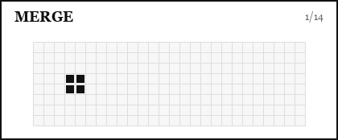

# Merge

`merge()` routes droplets into one merged footprint.

<figure class="dl-plan-demo" markdown>
  
  <figcaption><code>merge()</code> routing two droplets into one merged footprint</figcaption>
</figure>

```python
merged_id = system.advanced_drop.merge(
    droplet_ids=[1, 2],
    target=(40, 40),
)
```

The function extends `system.advanced_drop.plan` and returns the ID of the merged droplet, or `None` if the merge could not create a valid merged droplet.

## Public Signature

```python
system.advanced_drop.merge(
    droplet_ids,
    target,
    forced_width=None,
    forced_height=None,
    hold_final_position=False,
    event_id=None,
    remove_duplicate_frames=False,
)
```

## Target Modes

`target` can be a coordinate:

```python
merged_id = ad.merge([1, 2, 3], target=(50, 50))
```

or an existing droplet ID:

```python
merged_id = ad.merge([1, 2], target=3)
```

When `target` is a droplet ID, the other droplets merge into that droplet's current position.

## Shape Control

By default, DropLogic builds a compact merged footprint from the total electrode count.

Use `forced_width` or `forced_height` when the merged droplet must fit a specific geometry:

```python
merged_id = ad.merge(
    droplet_ids=[1, 2, 3],
    target=(45, 45),
    forced_width=3,
    forced_height=2,
)
```

## Holding the Final Footprint

`hold_final_position=True` activates the merged footprint across the merge frames.

```python
merged_id = ad.merge(
    droplet_ids=[1, 2],
    target=(40, 40),
    hold_final_position=True,
)
```

This is useful when droplets need extra electrical support at the merge destination.

## Event Labels

```python
merged_id = ad.merge(
    droplet_ids=[1, 2],
    target=(40, 40),
    event_id="merge_reagents",
)
```

Events appear in the plan and in the plan debugger.

## Common Pattern

```python
ad.droplets.create_droplet(1, (10, 10), (30, 30), width=1, height=1)
ad.droplets.create_droplet(2, (10, 20), (30, 30), width=1, height=1)

ad.move(mode="sipp")
merged_id = ad.merge([1, 2], target=(30, 30), hold_final_position=True)

ad.executor.start(frame_delay=0.7, enable_visualizers=True)
```

The merge operation uses movement planning internally, so constrained layouts can still fail if droplets cannot route safely to the merge hub.
