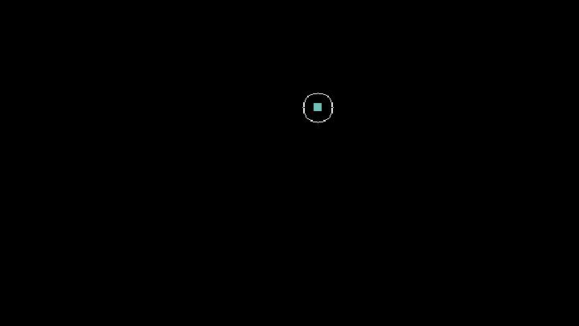

# Fusion

`merge()` enruta varias gotas hacia una sola huella fusionada.

```python
merged_id = system.advanced_drop.merge(
    droplet_ids=[1, 2],
    target=(40, 40),
)
```

La funcion extiende `system.advanced_drop.plan` y devuelve el ID de la gota fusionada, o `None` si no puede crear una fusion valida.

## Firma Publica

```python
system.advanced_drop.merge(
    droplet_ids,
    target,
    forced_width=None,
    forced_height=None,
    hold_final_position=False,
    event_id=None,
    remove_duplicate_frames=False,
)
```

## Modos De Objetivo

`target` puede ser una coordenada:

```python
merged_id = ad.merge([1, 2, 3], target=(50, 50))
```

o el ID de una gota existente:

```python
merged_id = ad.merge([1, 2], target=3)
```

Cuando `target` es un ID, las otras gotas se fusionan en la posicion actual de esa gota.

## Control De Forma

Por defecto, DropLogic construye una huella compacta a partir del numero total de electrodos.

Usa `forced_width` o `forced_height` cuando la gota fusionada deba encajar en una geometria concreta.

```python
merged_id = ad.merge(
    droplet_ids=[1, 2, 3],
    target=(45, 45),
    forced_width=3,
    forced_height=2,
)
```

## Mantener La Huella Final

`hold_final_position=True` activa la huella fusionada durante los frames de fusion.

```python
merged_id = ad.merge(
    droplet_ids=[1, 2],
    target=(40, 40),
    hold_final_position=True,
)
```

Esto es util cuando las gotas necesitan soporte electrico adicional en el destino.

## Etiquetas De Evento

```python
merged_id = ad.merge(
    droplet_ids=[1, 2],
    target=(40, 40),
    event_id="merge_reagents",
)
```

Los eventos aparecen en el plan y en el plan debugger.

## Patron Comun

<figure class="dl-plan-demo" markdown>
  
  <figcaption>Grabacion de <code>PlanExecutor</code> de <code>merge()</code>: dos gotas 1x1 enrutadas hacia una huella fusionada</figcaption>
</figure>

```python
ad.droplets.create_droplet(1, origin=(18, 18), target=(18, 18), width=1, height=1)
ad.droplets.create_droplet(2, origin=(18, 32), target=(18, 32), width=1, height=1)

merged_id = ad.merge(
    [1, 2],
    target=(24, 25),
    hold_final_position=True,
)

ad.executor.start(frame_delay=0.7, enable_visualizers=True)
```

La fusion usa planificacion de movimiento internamente, asi que layouts restringidos pueden fallar si las gotas no pueden llegar de forma segura al punto de fusion.
