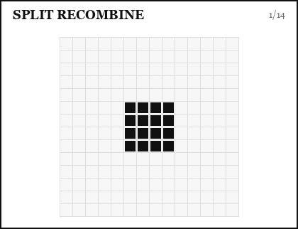
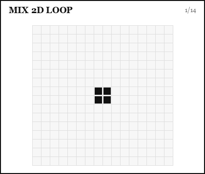

# Mix

`mix()` creates mixing motion for one droplet.

```python
new_ids = system.advanced_drop.mix(
    droplet_id=1,
    mode="split_recombine",
    cycles=5,
)
```

The function extends `system.advanced_drop.plan` and returns the IDs of any new droplets created during the operation.

The two built-in modes follow classic digital-microfluidic mixing strategies:
move the intact droplet through a 2D loop to reduce reversible flow, or split
and recombine it when the droplet geometry makes splitting reliable.<sup class="dl-cite dl-cite--left"><a href="#ref-paik-2003" aria-describedby="cite-paik-2003">1</a><span id="cite-paik-2003" class="dl-cite__preview" role="tooltip"><span class="dl-cite__label">Reference</span><span class="dl-cite__meta">LOC 2003</span><strong class="dl-cite__title">Rapid droplet mixers for digital microfluidic systems</strong><span class="dl-cite__authors">P. Paik, V. K. Pamula and R. B. Fair</span><span class="dl-cite__summary">Compares linear-array, 2D-array, and split-and-merge droplet mixers, motivating looped motion and split/recombine strategies for DMF mixing.</span></span></sup>

## Choosing a Mode

<div class="dl-table-scroll">
  <table class="dl-mode-table">
    <thead>
      <tr>
        <th>Mode</th>
        <th>Use when</th>
        <th>Be careful when</th>
        <th>Main knobs</th>
      </tr>
    </thead>
    <tbody>
      <tr>
        <td><code>split_recombine</code></td>
        <td>The droplet can split cleanly and you want strong internal rearrangement by repeated split/merge cycles.</td>
        <td>The footprint is small, asymmetric, close to obstacles, or the physical system does not split reliably.</td>
        <td><code>cycles</code><br><code>split_area</code></td>
      </tr>
      <tr>
        <td><code>2d_loop</code></td>
        <td>The droplet should stay intact while moving through a 2D loop; useful for smaller droplets or conservative protocols.</td>
        <td>The available loop area is tiny, blocked, or too close to other active droplets.</td>
        <td><code>cycles</code><br><code>mixing_area_size</code></td>
      </tr>
    </tbody>
  </table>
</div>

## Public Signature

```python
system.advanced_drop.mix(
    droplet_id,
    mode="split_recombine",
    split_area=None,
    mixing_area_size=None,
    cycles=5,
    event_id=None,
    remove_duplicate_frames=False,
)
```

## `split_recombine`

This mode repeatedly splits and recombines a droplet when the droplet shape allows it.

<figure class="dl-plan-demo" markdown>
  
  <figcaption><code>PlanExecutor</code> recording of <code>mix(mode="split_recombine")</code>: one 2x2 droplet split and recombined for one cycle</figcaption>
</figure>

```python
ad.droplets.create_droplet(
    1,
    origin=(28, 28),
    target=(28, 28),
    width=2,
    height=2,
)

new_ids = ad.mix(
    droplet_id=1,
    mode="split_recombine",
    cycles=1,
)
```

Use `split_area` if the operation needs a specific area for symmetric extension:

```python
split_area = {(r, c) for r in range(20, 30) for c in range(20, 30)}

ad.mix(
    droplet_id=1,
    mode="split_recombine",
    split_area=split_area,
    cycles=4,
)
```

If the droplet cannot be split safely, the implementation can fall back to loop-style movement for the remaining cycles.

## `2d_loop`

This mode moves the droplet around a rectangular loop.

<figure class="dl-plan-demo" markdown>
  
  <figcaption><code>PlanExecutor</code> recording of <code>mix(mode="2d_loop")</code>: one 2x2 droplet moved around a rectangular loop</figcaption>
</figure>

```python
ad.droplets.create_droplet(
    1,
    origin=(24, 24),
    target=(24, 24),
    width=2,
    height=2,
)

ad.mix(
    droplet_id=1,
    mode="2d_loop",
    mixing_area_size=8,
    cycles=1,
)
```

Use this when you want mixing by repeated translation rather than splitting.

## Event Labels

```python
ad.mix(
    droplet_id=1,
    mode="2d_loop",
    cycles=4,
    event_id="mix_sample",
)
```

Event labels make long protocols easier to inspect in the plan debugger.

## References

<ol class="dl-references-list">
  <li id="ref-paik-2003">P. Paik, V. K. Pamula and R. B. Fair, <a href="https://pubs.rsc.org/en/content/articlelanding/2003/lc/b307628h">"Rapid droplet mixers for digital microfluidic systems"</a>, <em>Lab on a Chip</em> 3, 253-259 (2003), DOI: <a href="https://doi.org/10.1039/B307628H">10.1039/B307628H</a>.</li>
</ol>
