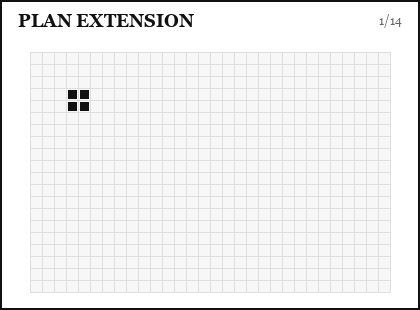

# Plan Objects

`AdvancedDrop` stores protocol output in `system.advanced_drop.plan`.

The plan is a `DropletPlan`: a frame-by-frame description of matrix states, droplet trajectories, active droplets, and event metadata.

<figure class="dl-plan-demo" markdown>
  
  <figcaption>Plan extension: create, move, retarget, then append another <code>move()</code></figcaption>
</figure>

## `DropletPlan` Fields

- `frames`: list of 2D arrays. Each frame is the electrode matrix to send to the system.
- `frame_count`: number of frames.
- `droplet_trajectories`: dictionary mapping droplet ID to `(row, col)` positions over time.
- `active_droplets_per_frame`: list of active droplet IDs for each frame.
- `events`: chronological event list as `(frame_index, event_type, metadata)`.
- `planning_success`: overall boolean.
- `conflicts_resolved`: diagnostic conflict metadata.
- `targets_reached`: dictionary mapping droplet ID to boolean.
- `event_id_per_frame`: event ID tag for each frame.

## Inspect a Plan

```python
plan = system.advanced_drop.plan

print(plan.frame_count)
print(plan.planning_success)
print(plan.targets_reached)
print(plan.events)
```

To inspect one frame:

```python
frame_10 = plan.frames[10]
active_ids = plan.active_droplets_per_frame[10]
```

## Get a Droplet Position

`AdvancedDrop.get_droplet_position()` returns the final planned position.

```python
final_pos = system.advanced_drop.get_droplet_position(1)
```

`PlanExecutor.get_droplet_position()` returns the last executed position during runtime.

```python
runtime_pos = system.advanced_drop.executor.get_droplet_position(1)
```

## Extend Plans

Most public operations extend the current plan automatically:

```python
ad.droplets.create_droplet(1, (10, 10), (20, 20), width=2, height=2)
ad.move(mode="sipp")
ad.mix(1, mode="2d_loop", cycles=3)
ad.merge([1, 2], target=(40, 40))
```

Use `extend_plan()` directly only when composing a custom `DropletPlan`.

```python
ad.plan = ad.extend_plan(
    existing_plan=ad.plan,
    new_plan=custom_plan,
    event_type="custom_step",
    event_data={"source": "external planner"},
)
```

## Remove Duplicate Frames

```python
ad.remove_duplicates(start_idx=0, end_idx=-1)
```

This removes duplicate frames in a range and remaps trajectories/events. Use it after planning, not while the executor is running.

This is still mostly a development/debugging cleanup tool. It may merge event boundaries that are useful for breakpoints, diagnostics, or protocol inspection, so avoid using it routinely in production unless you have checked the resulting plan.

## Merge Sequential Events

`merge_sequential_events()` combines two sequential event spans.

```python
new_event_id = ad.merge_sequential_events(
    event_id_1=3,
    event_id_2=4,
    force=False,
)
```

This is useful when two planned operations should behave as one combined event in the plan.

Set `force=True` only when you understand the electrode conflicts being overridden.

## Save a Plan

Plan saving is usually handled by the executor:

```python
ad.executor.start(
    frame_delay=0.5,
    save_to_file="runs/protocol.pkl",
)
```

The saved pickle contains:

- `plan`
- `droplets`

That format is understood by the plan debugger.
