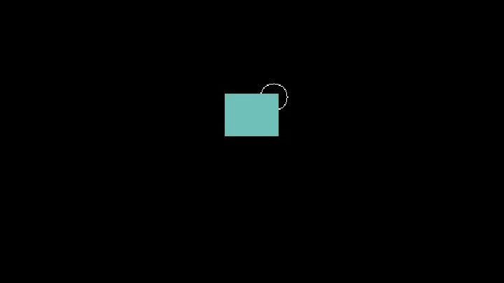
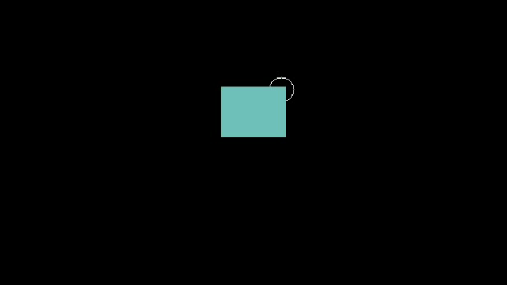
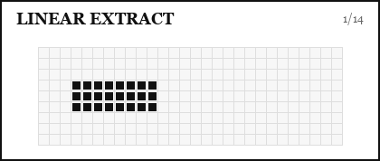

# Split and Extract

DropLogic has two public split-style operations:

- `reservoir_extraction()`: create one or more droplets from a reservoir droplet.
- `isometric_split()`: split one droplet into symmetric subdroplets.

Both functions extend `system.advanced_drop.plan` and return the IDs of newly created droplets.

## Reservoir Extraction

```python
new_ids = system.advanced_drop.reservoir_extraction(
    reservoir_droplet_id=1,
    split_mode="1to2",
    steps=(0, 10),
    split_size={(2, 2), (2, 3), (3, 2), (3, 3)},
    new_droplet_id=10,
)
```

Arguments:

- `reservoir_droplet_id`: ID of the reservoir droplet.
- `split_mode`: `"1to2"`, `"1to3"`, or `"linear"`.
- `steps`: displacement from reservoir corner for `"1to2"` and `"1to3"`.
- `split_size`: extracted droplet shape or size.
- `new_droplet_id`: optional first new ID. If omitted, IDs are generated.
- `halo_size`: inactive halo around extracted droplet for `"1to2"`.
- `separation_steps`: separation distance for `"1to3"`.
- `remove_duplicate_frames`: trim repeated frames after extension.

`steps` are `(row_delta, col_delta)`. Negative row moves upward. Positive column moves rightward.

For `"1to2"`, pass `split_size` as an explicit set of reservoir-relative coordinates when you want to extract from a specific region. For example, `{(2, 2), (2, 3), (3, 2), (3, 3)}` extracts the central `2x2` area of a `6x6` reservoir.

## `1to2`

Extract one droplet from the reservoir.

<figure class="dl-plan-demo" markdown>
  
  <figcaption><code>PlanExecutor</code> recording of <code>reservoir_extraction(split_mode="1to2")</code>: 6x6 reservoir, central 2x2 extracted droplet</figcaption>
</figure>

```python
ad.droplets.create_droplet(
    1,
    origin=(20, 16),
    target=(20, 16),
    width=6,
    height=6,
)

new_ids = ad.reservoir_extraction(
    reservoir_droplet_id=1,
    split_mode="1to2",
    steps=(0, 10),
    split_size={(2, 2), (2, 3), (3, 2), (3, 3)},
    halo_size=1,
)
```

Use this when you want a reservoir to keep most of its footprint while producing one smaller droplet.

## `1to3`

Extract a central droplet and separate the resulting pieces.

<figure class="dl-plan-demo" markdown>
  
  <figcaption><code>PlanExecutor</code> recording of <code>reservoir_extraction(split_mode="1to3")</code>: 12x12 reservoir, central 2x2 extracted droplet, reservoir pieces separated</figcaption>
</figure>

```python
ad.droplets.create_droplet(
    1,
    origin=(24, 16),
    target=(24, 16),
    width=12,
    height=12,
)

new_ids = ad.reservoir_extraction(
    reservoir_droplet_id=1,
    split_mode="1to3",
    steps=(0, 14),
    split_size=(2, 2),
    separation_steps=4,
)
```

For `"1to3"`, `split_size` is interpreted as `(height, width)`.

This mode is useful when direct reservoir dispensing is geometrically constrained.
The idea is related to the "one-to-three" droplet generation literature: rather
than pulling a single daughter droplet directly from a reservoir, the protocol
temporarily opens space around the extracted droplet so pinch-off can happen
with more controlled geometry. That can make `1to3` preferable to a simple
`1to2` extraction when small, repeatable droplets are needed from compact
electrode layouts.

Further reading:

- C. Hu, H. Zhang, C. Jiang and H. Ma, ["A geometrical model of pinch-off in digital microfluidics underpins 'one-to-three' droplet generation"](https://pubs.aip.org/aip/apl/article/120/12/121602/2833126/A-geometrical-model-of-pinch-off-in-digital), Applied Physics Letters 120, 121602 (2022), DOI: [10.1063/5.0086953](https://doi.org/10.1063/5.0086953).
- K. Jin, C. Hu, S. Hu, C. Hu, J. Li and H. Ma, ["'One-to-three' droplet generation in digital microfluidics for parallel chemiluminescence immunoassays"](https://pubs.rsc.org/it-it/content/articlelanding/2021/lc/d1lc00421b), Lab on a Chip 21, 2892-2900 (2021), DOI: [10.1039/D1LC00421B](https://doi.org/10.1039/D1LC00421B).

## `linear`

Create multiple droplets in a linear sweep from a reservoir.

<figure class="dl-plan-demo" markdown>
  
  <figcaption><code>PlanExecutor</code> recording of <code>reservoir_extraction(split_mode="linear")</code>: wide reservoir, three complete lines of 1x1 droplets produced in a horizontal sweep</figcaption>
</figure>

```python
ad.droplets.create_droplet(
    1,
    origin=(18, 18),
    target=(18, 18),
    width=10,
    height=14,
)

new_ids = ad.reservoir_extraction(
    reservoir_droplet_id=1,
    split_mode="linear",
    linear_drops_number=21,
    linear_offset=0,
    linear_space_per_col=3,
    linear_space_per_row=1,
    linear_drop_shape=(1, 1),
    linear_direction=(0, 1),
)
```

Use `linear_direction=(0, 1)` for a horizontal sweep to the right, `(1, 0)` for downward, and negative values for the opposite direction.

## Isometric Split

`isometric_split()` recursively splits a droplet into equal subdroplets and moves them symmetrically.

<figure class="dl-plan-demo" markdown>
  
  <figcaption><code>PlanExecutor</code> recording of <code>isometric_split()</code>: one 2x2 droplet split until the final active droplets are four uniformly spaced 1x1 droplets</figcaption>
</figure>

```python
ad.droplets.create_droplet(
    1,
    origin=(28, 28),
    target=(28, 28),
    width=2,
    height=2,
)

new_ids = ad.isometric_split(
    droplet_id=1,
    steps=[(0, 6), (6, 0)],
    simultaneous=True,
    new_droplet_id=2,
)
```

The example above:

- splits once horizontally and moves two 2-electrode subdroplets left/right.
- splits each result vertically and moves the resulting 1-electrode droplets up/down.
- ends with four active 1x1 droplets arranged as a uniformly spaced square.

Arguments:

- `droplet_id`: source droplet.
- `steps`: list of `(row_delta, col_delta)` displacement steps.
- `simultaneous`: move subdroplets within a split step together or sequentially.
- `new_droplet_id`: optional first new ID.
- `event_id`: optional event label for the plan.
- `remove_duplicate_frames`: trim repeated frames after extension.

## Common Failure Cases

- The source droplet or reservoir ID does not exist.
- `steps` would place new droplets outside the matrix.
- The extracted droplet overlaps the reservoir.
- The source droplet does not have enough electrodes for the requested split.
- The surrounding area is too constrained for separation movement.
