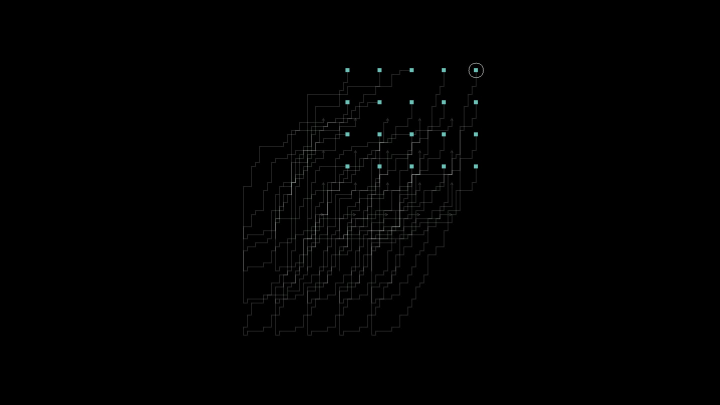

# Simulator

`Simulator` 係 DropLogic 入面預設嘅純軟件系統。當你想驗證 protocol、測試規劃邏輯，或者喺唔連接實體硬件嘅情況下檢查矩陣行為時，佢係最好嘅起點。



呢個 demo 來自一個真實 `Simulator` plan，由啟用矩陣錄影嘅 `PlanExecutor` 執行。點代表液滴，幼灰色路徑代表計劃路線。

## 佢提供咩

模擬器目前包含：

- 模擬電極矩陣
- 模擬 XY stage 介面
- `MatrixVisualizer`
- `AdvancedDrop` 規劃層

呢點令佢適合大多數早期開發，尤其係迭代液滴 routing 或除錯狀態轉換時。

## 點解重要

模擬器保留咗真實機器使用嘅同一套系統級結構：

- 佢繼承自 `DropSystem`
- 佢透過相同嘅 queue-based 機制 route 命令
- 佢透過熟悉嘅 attributes 暴露系統組件

即係針對模擬器寫嘅 protocol 通常只需要好少修改就可以搬到真實系統。

## 主要用例

- 唔連接硬件時開發
- 除錯規劃同執行
- 視覺化驗證液滴移動
- 測試狀態轉換同命令 routing

## 目前範圍

模擬器刻意保持輕量。佢專注於算法開發最有用嘅部分：

- 電極激活狀態
- XY 位置狀態
- 矩陣視覺化

佢唔會嘗試模擬真實機器嘅所有物理效應。

## 典型入口

```python
from droplogic.hardware.simulator import Simulator

system = Simulator(log_level="INFO")
```

之後，你可以好似喺真實系統腳本入面一樣使用標準 `advanced_drop` 工作流同矩陣 visualizer。
